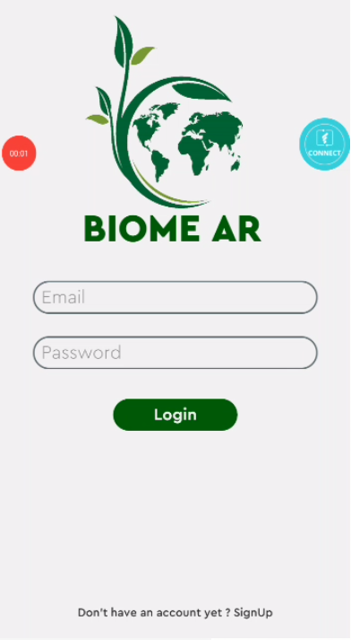
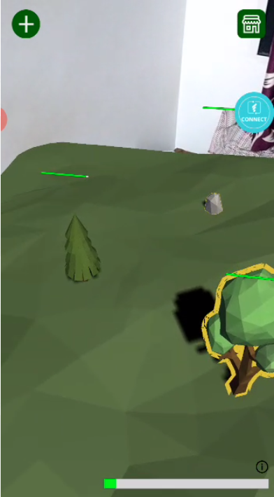
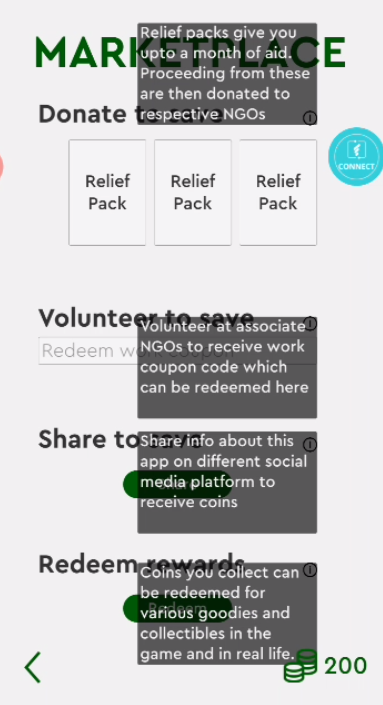
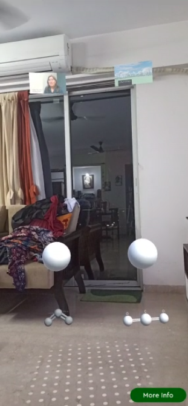
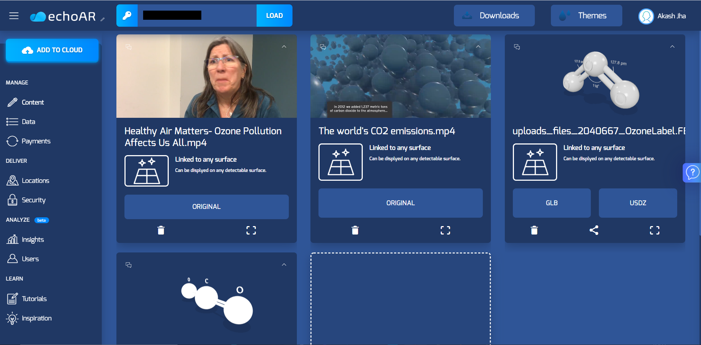

# BiomeAR
 With this one of a kind game you can setup your Biome only to watch it die off after some time, maybe days or maybe week.

This game utilizes real world data for different environment factors(only air quality right now) in your location to affect your in game assets. So for example the trees that you are planting in the game may die soon if Air quality in your area is bad. The worse the Air quality the more harsh are the effects.

But that is not it, this part just tell you the problem. What now ?
We have a marketplace that lets you make a change in 3 ways :
1) You can buy a relief pack which will make your biome safe for a month (or more)
2) You can choose to volunteer in affiliated NGOs and they will give you a coupon code which you can redeem for in game coins
3) You can share the app with your friends and spread awareness for Climate Change

The coins that you collect in the game can not only be used towards the game. Maybe you don't really care about the game, so we have something more for you ! You can exchange these coins for goodies.

BUT THAT IS NOT IT EITHER!!!
We have a leader board that shows the top earners and spenders on our platform.
Whatever your reason may be, you can use this app to make a difference.

And if you are still wondering why there is a need for any of this , we have one more feature !! Awareness Hub. Using EchoAR and AR foundation we present molecules of some common pollutants floating around in Augmented Reality , by clicking on the spheres above them you can start a video which is directly streamed from echoAR. We can change these videos to latest information whenever required without any need to change the code due to the use of echoAR.

 
 

